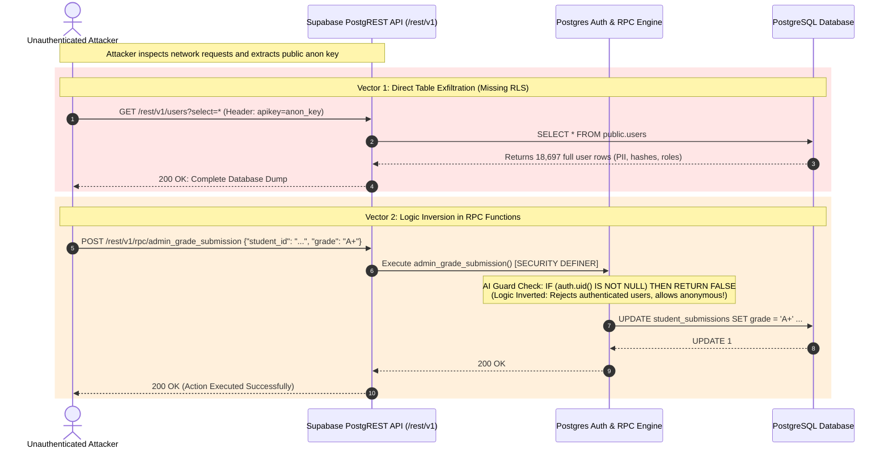
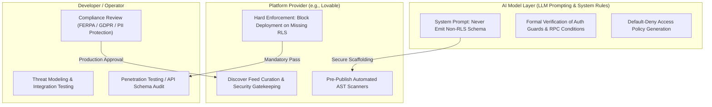

# Cybersecurity Case Study: The "Vibe Coding" Security Dilemma
## Technical Root-Cause Analysis of AI-Generated Backend Flaws & Supabase Misconfigurations in Rapid Prototyping Platforms

---

```
Document Reference : CS-2026-VIBECODE-01
Classification     : PUBLIC / EDUCATIONAL SECURITY RESEARCH
Target Ecosystem   : Full-Stack AI Code Generators (Lovable, Supabase, PostgreSQL)
Incident Source    : Disclosed February 2026 (18.6k+ Exposed Educational Records)
Author / Pipeline  : Multi-Agent Cybersecurity Research Orchestrator
```

---

## 1. Executive Summary

In February 2026, independent security research revealed that a high-profile application created on the AI "vibe-coding" platform **Lovable** and showcased on its community Discover feed exposed more than **18,697 user records**—including student accounts, educator records, organizational administrators, and full Personally Identifiable Information (PII) across universities and K-12 schools.

The incident highlights a critical systemic vulnerability pattern in the emerging **"vibe coding" paradigm**: AI code generators optimize heavily for visual functionality and rapid developer feedback loops ("it compiles and runs"), frequently bypassing foundational security controls such as **Row-Level Security (RLS)**, **Remote Procedure Call (RPC) authorization guards**, and **least-privilege database schemas**.

```
+-----------------------------------------------------------------------------------+
|                               INCIDENT AT A GLANCE                                |
+-------------------------+---------------------------------------------------------+
| Disclosed Impact        | 18,697 Exposed Records (14,928 unique emails, 4,538     |
|                         | student profiles, 870 full PII dossiers)                |
| Primary Vulnerabilities | 16 Discovered Flaws (6 Critical Severity)               |
| Core Root Causes        | 1. Missing Database Row-Level Security (RLS)            |
|                         | 2. Inverted Logic in Postgres RPC Security Functions    |
|                         | 3. Client-Side Authorization Illusions                  |
|                         | 4. Unprotected Remote Database Administrative APIs      |
| Target Backend Stack    | Supabase (PostgreSQL + PostgREST + GoTrue Auth)         |
| Impact Radius           | Unauthenticated Data Exfiltration, Account Deletion,     |
|                         | Unauthorized Exam Grade Modification, Bulk Email Abuse  |
+-------------------------+---------------------------------------------------------+
```

---

## 2. Threat Vector & Architectural Exposure Flow

In typical full-stack AI development platforms, the client interface (React/TypeScript) connects directly to a Backend-as-a-Service (BaaS) like Supabase. When an AI generates client-side queries against PostgREST without enabling and enforcing backend Postgres Row-Level Security (RLS), the entire database becomes accessible to anyone holding the public `anon_key`.

### 2.1 Attack Sequence Diagram



---

## 3. Technical Root-Cause Analysis

### Flaw Category 1: Missing Row-Level Security (RLS) on Exposed PostgREST Entities
When AI generates database migration scripts, it frequently creates standard SQL tables (`CREATE TABLE public.profiles (...)`) without running `ALTER TABLE public.profiles ENABLE ROW LEVEL SECURITY;`. 

Because PostgREST maps all database tables directly to HTTP endpoints (`/rest/v1/profiles`), any anonymous user possessing the frontend `anon_key` can execute arbitrary `SELECT`, `INSERT`, `UPDATE`, or `DELETE` requests directly against the database table.

### Flaw Category 2: Inverted Logic in PostgreSQL RPC Functions (`SECURITY DEFINER`)
In PostgreSQL, functions marked `SECURITY DEFINER` execute with the privileges of the database user who created them (typically `postgres` or `admin`).

When generating administrative operations (e.g., account deletion, grade submission, mass emailing), the AI generated authorization guard logic with **inverted boolean conditions**:
* **Intended Logic**: Verify that the caller is logged in and possesses an administrative role; reject anonymous users.
* **AI-Generated Logic**: Evaluated whether `auth.uid()` was truthy and threw an error/exited, allowing unauthenticated requests (`auth.uid() IS NULL`) to fall through directly to the privileged mutation query.

### Flaw Category 3: Client-Side Authorization Illusion
The AI model satisfied prompt constraints (e.g., *"Only admins can see the user management panel"*) solely by hiding UI components in React:
```tsx
// Flawed AI logic: UI is hidden, but the underlying API and database endpoints are wide open
{currentUser?.role === 'admin' && <AdminUserTable />}
```
Without server-side policy enforcement, hiding UI buttons provides zero security boundary against direct API invocation.

---

## 4. Side-by-Side Code Comparisons (Vulnerable AI Code vs. Remediated Defense)

### 4.1 PostgreSQL Schema & Row-Level Security (RLS)

#### ❌ Vulnerable AI-Generated SQL (Missing RLS & Unrestricted Grants)
```sql
-- VULNERABLE: AI creates table and grants global access without RLS
CREATE TABLE public.user_profiles (
    id UUID PRIMARY KEY DEFAULT gen_random_uuid(),
    user_id UUID REFERENCES auth.users(id) ON DELETE CASCADE,
    full_name TEXT NOT NULL,
    email TEXT NOT NULL,
    role TEXT DEFAULT 'student',
    school_organization TEXT,
    created_at TIMESTAMPTZ DEFAULT now()
);

-- Public PostgREST endpoint enabled with zero access controls
GRANT ALL ON public.user_profiles TO anon;
GRANT ALL ON public.user_profiles TO authenticated;
-- CRITICAL DEFECT: RLS is NOT enabled. 
-- Anyone with the public anon key can run: SELECT * FROM user_profiles
```

#### ✅ Remediated Production-Grade Defense SQL
```sql
-- REMEDIATED: Explicit RLS enforcement, typed roles, and strict policy boundary
CREATE TABLE public.user_profiles (
    id UUID PRIMARY KEY DEFAULT gen_random_uuid(),
    user_id UUID NOT NULL REFERENCES auth.users(id) ON DELETE CASCADE,
    full_name TEXT NOT NULL,
    email TEXT NOT NULL,
    role TEXT NOT NULL DEFAULT 'student' CHECK (role IN ('student', 'instructor', 'admin')),
    school_organization TEXT,
    created_at TIMESTAMPTZ DEFAULT now(),
    CONSTRAINT unique_user_id UNIQUE (user_id)
);

-- 1. Enable Row Level Security immediately
ALTER TABLE public.user_profiles ENABLE ROW LEVEL SECURITY;
ALTER TABLE public.user_profiles FORCE ROW LEVEL SECURITY;

-- 2. Restrict direct public grants to least privilege
REVOKE ALL ON public.user_profiles FROM anon;
GRANT SELECT, UPDATE ON public.user_profiles TO authenticated;

-- 3. Policy: Users can only read their own profile, or instructors/admins can read their school
CREATE POLICY "users_read_own_profile" ON public.user_profiles
    FOR SELECT
    TO authenticated
    USING (
        auth.uid() = user_id
        OR EXISTS (
            SELECT 1 FROM public.user_profiles p
            WHERE p.user_id = auth.uid() 
              AND p.role IN ('instructor', 'admin')
              AND p.school_organization = user_profiles.school_organization
        )
    );

-- 4. Policy: Users can only update their own profile data (excluding role)
CREATE POLICY "users_update_own_profile" ON public.user_profiles
    FOR UPDATE
    TO authenticated
    USING (auth.uid() = user_id)
    WITH CHECK (
        auth.uid() = user_id 
        AND role = (SELECT role FROM public.user_profiles WHERE user_id = auth.uid())
    );
```

---

### 4.2 Supabase Remote Procedure Call (RPC) Function

#### ❌ Vulnerable AI-Generated RPC (Logic Inversion & Insecure Execution)
```sql
-- VULNERABLE: AI attempted to write an auth guard, but inverted the logic condition
CREATE OR REPLACE FUNCTION public.admin_modify_user_grade(
    target_student_id UUID,
    new_grade TEXT
)
RETURNS JSONB
LANGUAGE plpgsql
SECURITY DEFINER -- Runs as database owner (superuser)
SET search_path = public
AS $$
DECLARE
    caller_role TEXT;
BEGIN
    -- LOGIC INVERSION BUG:
    -- If caller IS logged in, AI incorrectly flags them and aborts.
    -- If caller IS NULL (anonymous unauthenticated attacker), condition evaluates to FALSE,
    -- allowing unauthenticated users to bypass the guard and execute privileged updates!
    IF (auth.uid() IS NOT NULL) THEN
        RAISE EXCEPTION 'Access Denied: Restricted Operation';
    END IF;

    UPDATE public.exam_submissions
    SET grade = new_grade, updated_at = now()
    WHERE student_id = target_student_id;

    RETURN jsonb_build_object('success', true, 'message', 'Grade updated');
END;
$$;

GRANT EXECUTE ON FUNCTION public.admin_modify_user_grade TO anon, authenticated;
```

#### ✅ Remediated Production-Grade Defense RPC
```sql
-- REMEDIATED: Secure execution, strict auth guard, role check, and input sanitization
CREATE OR REPLACE FUNCTION public.admin_modify_user_grade(
    target_student_id UUID,
    new_grade TEXT
)
RETURNS JSONB
LANGUAGE plpgsql
SECURITY DEFINER
SET search_path = public, pg_temp -- Prevent search_path hijacking
AS $$
DECLARE
    current_caller_id UUID;
    caller_is_admin BOOLEAN;
BEGIN
    -- 1. Explicitly verify caller authentication
    current_caller_id := auth.uid();
    IF current_caller_id IS NULL THEN
        RAISE EXCEPTION 'Unauthorized: Caller must be authenticated'
            USING ERRCODE = '28000';
    END IF;

    -- 2. Verify caller has required instructor or admin role
    SELECT EXISTS (
        SELECT 1 FROM public.user_profiles
        WHERE user_id = current_caller_id
          AND role IN ('instructor', 'admin')
    ) INTO caller_is_admin;

    IF NOT caller_is_admin THEN
        RAISE EXCEPTION 'Forbidden: Insufficient privileges to alter examination records'
            USING ERRCODE = '42501';
    END IF;

    -- 3. Execute parameterized update
    UPDATE public.exam_submissions
    SET grade = new_grade,
        graded_by = current_caller_id,
        updated_at = now()
    WHERE student_id = target_student_id;

    IF NOT FOUND THEN
        RAISE EXCEPTION 'Record not found for student %', target_student_id
            USING ERRCODE = 'P0002';
    END IF;

    RETURN jsonb_build_object(
        'success', true,
        'student_id', target_student_id,
        'updated_by', current_caller_id,
        'timestamp', now()
    );
END;
$$;

-- Revoke execute from anonymous, allow authenticated only
REVOKE EXECUTE ON FUNCTION public.admin_modify_user_grade FROM PUBLIC, anon;
GRANT EXECUTE ON FUNCTION public.admin_modify_user_grade TO authenticated;
```

---

## 5. The Vibe Coding Shared Responsibility Model

A central governance debate emerging from this incident centers on accountability across the AI software supply chain:



### Responsibility Breakdown
1. **Platform Vendors**: Providing frictionless "publish to web" pipelines without hard enforcement of security gates allows non-technical users to publish unprotected backends. Platforms must transition from *advisory warnings* to *hard deployment blockers* when critical vulnerabilities (e.g., disabled RLS, public RPCs) are detected.
2. **AI Foundation Models & Tooling**: AI code assistants must be constrained by system prompts and post-processing linters that inject defense-in-depth patterns by default rather than as an afterthought.
3. **Application Creators**: Even in a "no-code/vibe-code" ecosystem, the entity deploying software to handle real user data retains legal and ethical liability under privacy frameworks (GDPR, CCPA, FERPA).

---

## 6. Secure AI Development Lifecycle (SecAIDLC) Checklist

To prevent similar vulnerabilities in AI-generated software, organizations and developers should implement the following automated guardrails:

* [ ] **Automated RLS Linter in CI/CD**: Run Supabase database linters (`splinter` / `supabase db lint`) on every migration commit. Reject any build where `rls_enabled` is false.
* [ ] **RPC Auth Audit**: Disallow `SECURITY DEFINER` on any function that does not begin with an explicit `auth.uid()` null-check and role assertion.
* [ ] **Static Secret & Endpoint Validation**: Ensure `service_role` keys are never bundled in frontend assets or client-accessible environment variables (`VITE_`, `NEXT_PUBLIC_`).
* [ ] **Automated Negative Authorization Tests**: Add integration tests verifying that unauthenticated requests to `/rest/v1/*` return `401 Unauthorized` or empty result sets (`[]`).
* [ ] **Sanitized Prompt Templates**: Enforce system-level instruction templates that explicitly instruct the LLM to output PostgreSQL schemas with RLS and RBAC policies enabled.

---

```
[END OF CASE STUDY]
Report Generated by Antigravity Autonomous Security Orchestrator
```
