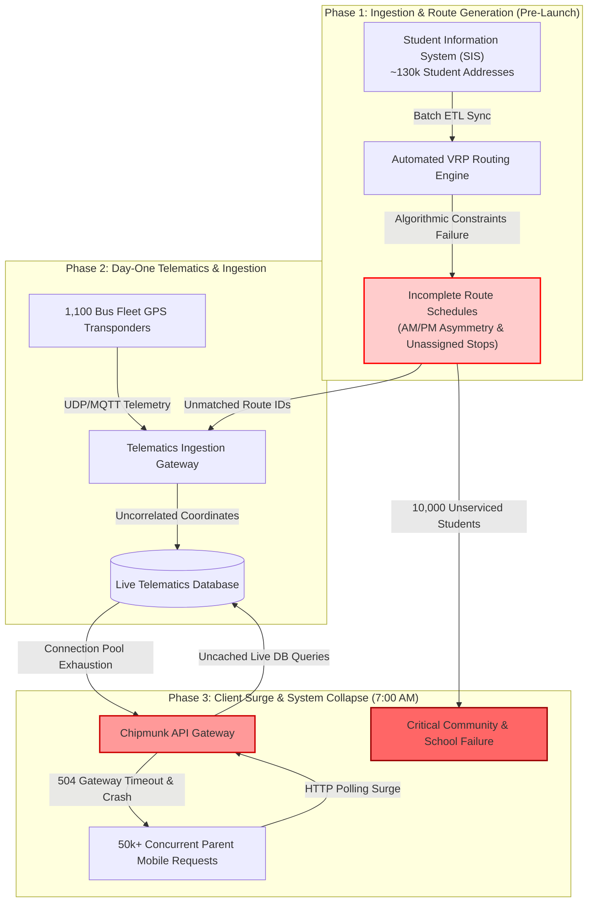

# Systems Engineering & Incident Post-Mortem: Public Sector EdTech Transportation Collapse
## Technical Root-Cause Analysis, Fleet Routing Algorithmic Failures, and Distributed Real-Time Telematics Outage (PGCPS / Chipmunk Case Study)

---

```
Document Reference : CS-2026-SYSENG-02
Classification     : PUBLIC / EDUCATIONAL RESILIENCE & SYSTEMS POST-MORTEM
Incident Context   : Prince George's County Public Schools (Maryland) Day-One Rollout
Impacted Entities  : ~10,000 Stranded Students, 1,100 Bus Fleet, "Chipmunk" GPS Tracking Outage
Orchestrator Role  : Multi-Agent Systems Reliability & Cybersecurity Research Pipeline
```

---

## 1. Executive Summary

On the opening day of the academic year, Prince George's County Public Schools (PGCPS)—one of the largest school districts in the United States, operating a fleet of approximately 1,100 buses—experienced a catastrophic transportation failure. Over **10,000 students** were left without morning transportation, stranded at stops, or assigned incomplete route schedules (e.g., afternoon drop-off scheduled with zero morning pickup).

Simultaneously, the district's newly deployed real-time GPS vehicle tracking mobile application (**"Chipmunk"**) suffered a total service collapse under initial morning load, leaving parents, school administrators, and dispatchers with zero operational visibility into fleet locations.

This case study analyzes the multi-layered breakdown across **automated Vehicle Routing Problem (VRP) algorithms**, **Student Information System (SIS) ETL pipeline failures**, **distributed telematics telemetry ingestion bottlenecks**, and **operational change management deficiencies**.

```
+-----------------------------------------------------------------------------------+
|                               INCIDENT AT A GLANCE                                |
+-------------------------+---------------------------------------------------------+
| Impact Radius           | ~10,000 Students Impacted; Dozens of Unassigned Routes;   |
|                         | Hundreds of Orphaned Bus Stops                          |
| Systems Involved        | 1. Centralized Routing Engine & Optimization Software   |
|                         | 2. "Chipmunk" Real-Time GPS Tracking Mobile App         |
|                         | 3. Student Information System (SIS) Data Sync Pipeline  |
|                         | 4. On-Vehicle Telematics & Mobile Dispatch Units        |
| Primary Failure Modes   | • Day-1 High-Concurrency Thundering Herd on Tracking API|
|                         | • Schedule Invariant Violations (AM/PM Asymmetry)       |
|                         | • Missing Fallback Caching & Offline Route Validation   |
|                         | • Inadequate Staging Load Tests & Staff Tooling Gaps    |
+-------------------------+---------------------------------------------------------+
```

---

## 2. Distributed Architecture & Cascading Failure Flow

The failure was not an isolated software glitch, but a cascading failure across the integration boundaries between the Student Information System, the automated routing optimizer, the telematics gateway, and the parent-facing mobile application.

### 2.1 Cascading Failure Architecture



---

## 3. Technical Root-Cause Breakdown

### 3.1 Algorithmic Invariant Violation: Route Asymmetry & Orphaned Stops
Vehicle Routing Problem (VRP) solvers generate multi-stop tours subject to capacity, time windows, and turn restrictions. In this deployment:
* **The Defect**: The constraint validation engine lacked a hard **bidirectional invariant check** (`∀ student ∈ Active: (has_am_route(student) ∧ has_pm_route(student))`).
* **The Failure**: When the routing engine encountered capacity limits on morning runs, it dropped the morning leg rather than raising a blocking compilation error. It successfully committed the afternoon leg, leading to students having afternoon drop-off bus assignments without morning pickups.

### 3.2 Telematics Ingestion & Thundering Herd on Client Tracking Gateway
At 7:00 AM on the first day of school, tens of thousands of parents opened the "Chipmunk" application simultaneously to track incoming buses.
* **Architecture Flaw**: The mobile client performed direct HTTP polling against the primary backend database without edge caching (Redis/CDN) or WebSocket pub/sub fanout.
* **Failure Execution**:
  $$\text{Request Rate} = N_{\text{users}} \times \frac{1}{\text{Poll Interval}} \approx 60,000 \times \frac{1}{3\,\text{s}} = 20,000\,\text{req/sec}$$
* The unindexed relational queries for live GPS points saturated database connection pools, causing cascading 504 timeouts and app crashes.

### 3.3 Change Management & Operational Readiness Deficit
* **Dry-Run Absence**: No full-scale district "dress rehearsal" (simulating 1,100 drivers executing routes with active GPS hardware prior to Day 1).
* **Operator Training Gaps**: Dispatchers and administrative staff had insufficient operational familiarity with the new software interface to perform manual route reassignments in real time.

---

## 4. Side-by-Side Systems Architecture (Vulnerable vs. Resilient Defense)

### 4.1 Route Compilation & Constraint Validation Invariants

#### ❌ Vulnerable Route Compiler (Permissive Commit with Silent Drops)
```python
# VULNERABLE IMPLEMENTATION: Allows partial/orphaned student route commits
class InsecureRouteGenerator:
    def compile_schedules(self, student_records, bus_fleet):
        schedules = {"am": {}, "pm": {}}
        
        for student in student_records:
            # Attempt morning assignment
            am_bus = self.find_available_bus(student, bus_fleet, shift="AM")
            if am_bus:
                schedules["am"][student.id] = am_bus.id
            # If am_bus is None, it silently ignores the failure and proceeds!
            
            # Attempt afternoon assignment
            pm_bus = self.find_available_bus(student, bus_fleet, shift="PM")
            if pm_bus:
                schedules["pm"][student.id] = pm_bus.id
                
        # CRITICAL FLAW: Commits partial schedules to production database
        # Students with PM-only routes are accepted with no pipeline failure
        self.commit_to_production(schedules)
        return schedules
```

#### ✅ Resilient Production-Grade Defense Route Compiler
```python
# REMEDIATED IMPLEMENTATION: Strict Invariant Checking, Atomic Commits, Dead-Letter Queues
from dataclasses import dataclass
from typing import List, Dict, Optional

@dataclass(frozen=True)
class RouteAssignment:
    student_id: str
    am_bus_id: str
    pm_bus_id: str
    am_stop_id: str
    pm_stop_id: str

class ResilientRouteCompiler:
    def __init__(self, db_session, alert_service):
        self.db = db_session
        self.alerts = alert_service

    def compile_and_verify_schedules(
        self, students: List[dict], fleet: List[dict]
    ) -> List[RouteAssignment]:
        validated_assignments: List[RouteAssignment] = []
        unassigned_students: List[dict] = []

        for student in students:
            am_route = self._solve_leg(student, fleet, shift="AM")
            pm_route = self._solve_leg(student, fleet, shift="PM")

            # HARD INVARIANT: Every student must have complete, symmetric transport
            if not am_route or not pm_route:
                unassigned_students.append({
                    "student_id": student["id"],
                    "missing_am": am_route is None,
                    "missing_pm": pm_route is None,
                    "school_id": student["school_id"],
                    "address": student["address"]
                })
                continue

            validated_assignments.append(RouteAssignment(
                student_id=student["id"],
                am_bus_id=am_route["bus_id"],
                pm_bus_id=pm_route["bus_id"],
                am_stop_id=am_route["stop_id"],
                pm_stop_id=pm_route["stop_id"]
            ))

        # GATEKEEPER CHECK: Disallow production commit if unassigned threshold > 0
        if unassigned_students:
            self._route_to_dead_letter_dispatch(unassigned_students)
            raise RoutingInvariantException(
                f"FATAL: {len(unassigned_students)} students failed route assignment. "
                "Production commit aborted to prevent partial deployment."
            )

        self._atomic_production_commit(validated_assignments)
        return validated_assignments

    def _route_to_dead_letter_dispatch(self, unassigned: List[dict]):
        self.alerts.trigger_p0_incident(
            title="Automated Routing Invariant Breach",
            payload=unassigned
        )
```

---

### 4.2 Real-Time Telematics & High-Concurrency Parent Tracking API

#### ❌ Vulnerable API (Direct Polling against Relational DB)
```typescript
// VULNERABLE: Direct relational database query on every 3-second poll
app.get("/api/v1/bus/location/:routeId", async (req, res) => {
  const { routeId } = req.params;
  
  // High-latency unindexed query executed 20,000 times/second
  const liveLocation = await db.query(
    "SELECT latitude, longitude, speed, updated_at FROM bus_telemetry WHERE route_id = $1 ORDER BY updated_at DESC LIMIT 1",
    [routeId]
  );
  
  // Causes connection starvation and DB lock contention
  return res.json(liveLocation.rows[0]);
});
```

#### ✅ Resilient Architecture (Redis Geo-Spatial + WebSocket Fanout / SSE)
```typescript
// REMEDIATED: In-Memory Redis Geo-Cache & SSE / WebSocket Push Notification
import { createClient } from "redis";

const redis = createClient({ url: process.env.REDIS_CLUSTER_URL });

export async function getLiveBusLocationHandler(req: Request, res: Response) {
  const routeId = req.params.routeId;
  
  // 1. Fetch from high-speed in-memory Geo cache (< 2ms response time)
  const cachedLocation = await redis.hGetAll(`telemetry:route:${routeId}`);
  
  if (!cachedLocation || !cachedLocation.lat) {
    // Graceful fallback to secondary read-replica with Circuit Breaker
    return res.status(200).json({
      status: "ESTIMATING",
      lastKnownScheduledTime: await getEstimatedArrivalTime(routeId),
      fallbackMode: true
    });
  }

  // 2. Set strict HTTP cache-control headers to enable Edge / CDN collapsing
  res.setHeader("Cache-Control", "public, max-age=3, s-maxage=3, stale-while-revalidate=2");
  
  return res.status(200).json({
    status: "ACTIVE",
    lat: parseFloat(cachedLocation.lat),
    lng: parseFloat(cachedLocation.lng),
    speed: parseFloat(cachedLocation.speed),
    timestamp: cachedLocation.timestamp
  });
}
```

---

## 5. Incident Timeline & Escalation Matrix

```mermaid
timeline
    title Prince George's County Transportation Failure Timeline
    T - 30 Days : Software Vendor Migration : District procures new routing engine & Chipmunk tracking app
    T - 7 Days  : Early Parent Feedback : Parents discover missing/asymmetric bus schedules in preview portal
    T - 0 (06:00 AM) : Driver Dispatch : Drivers report unassigned routes and unmatched turn-by-turn sheets
    T - 0 (07:00 AM) : The Collapse : 50k+ parents access Chipmunk app; API gateways crash under database lock contention
    T - 0 (08:30 AM) : Operational Failure : ~10,000 students miss morning pickup; school start severely disrupted
    T + 6 Hours (02:00 PM) : District Response : PGCPS leadership convenes press conference; emergency routing task force deployed
```

---

## 6. Public Sector Software Resilience Checklist (The 6 Pillars)

To prevent catastrophic service disruptions during public infrastructure and municipal EdTech rollouts:

* [ ] **Strict Route Invariant Verification**: The compilation pipeline must fail builds if any student has an asymmetric or unassigned transportation route (`AM/PM symmetry enforcement`).
* [ ] **Edge Caching & Read-Replica Decoupling**: Isolate all public/parent telemetry queries behind Redis clusters or Edge CDNs with strict cache TTLs (3–5 seconds) to absorb 50k+ concurrent requests.
* [ ] **Mandatory End-to-End "Dress Rehearsal"**: Conduct a simulated fleet dry run 7–10 days before go-live with all drivers, GPS units, and routing tablets transmitting concurrently.
* [ ] **Fallback Offline Manifests**: Provide drivers and dispatch centers with printed and cached offline PDF turn-by-turn manifests for every route.
* [ ] **Circuit Breakers on Real-Time Tracking**: If live GPS ingestion experiences latency, the client app must display scheduled timetable estimates rather than crashing with 504 errors.
* [ ] **Automated Data Reconciliation**: Continuous background reconciliation jobs comparing Student Information System enrollment with active routing manifests.

---

```
[END OF POST-MORTEM CASE STUDY]
Report Generated by Antigravity Autonomous Security & Systems Engineering Orchestrator
```
